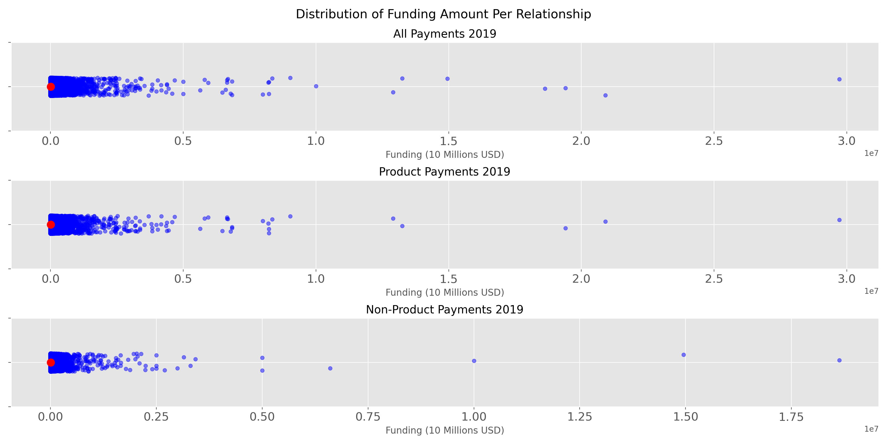
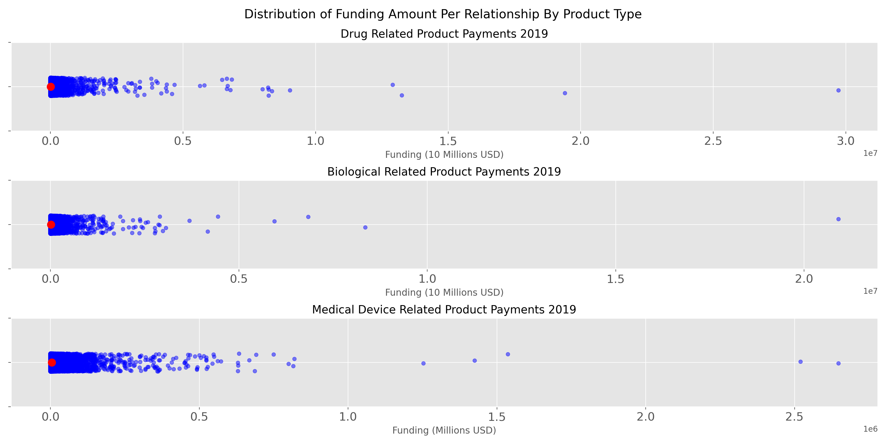
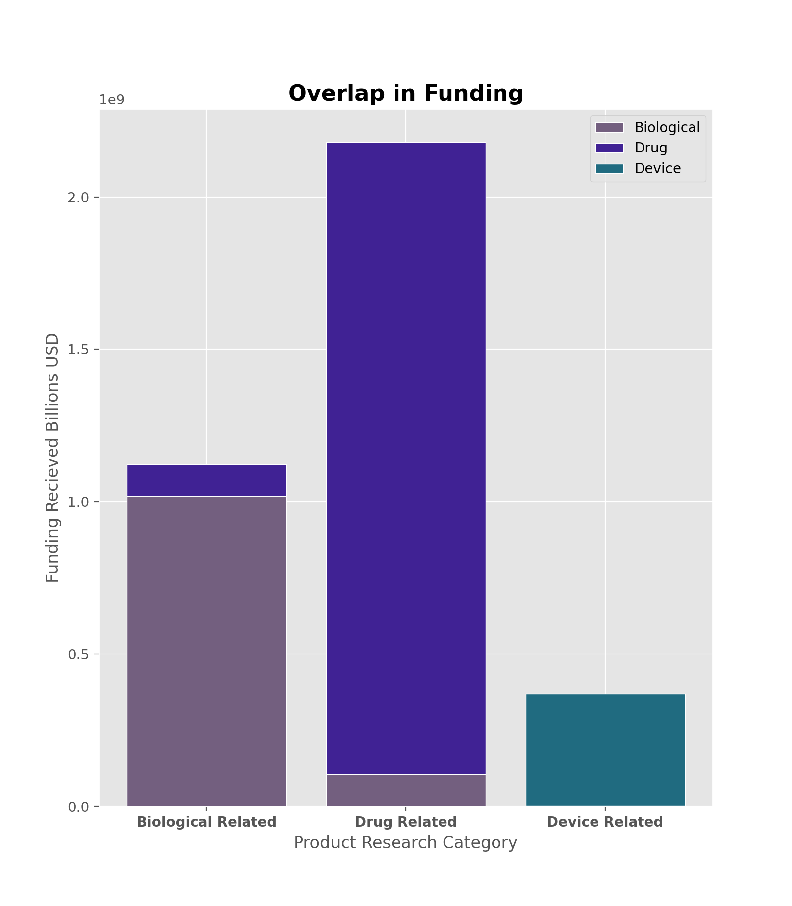

# Research-Funding-CMS

*Exploratory data analysis (EDA) of research related financial relationships between drug and device companies and physicians and teaching hospitals.*

## Contents
 
1. [Motivation](#Motivation)
2. [Data](#Data)
3. [EDA Crosswalk](#EDA)
4. [Summary of Findings](#Summary)
5. [Lessons Learned](#Lessons)

-------

## <a name="Motivation">Motivation</a>

As a Data Scientist I want to improve quality of life by increasing equity to healthcare and supporting medical advancements. Coming from another industry I have a steep learning curve that I work towards flattening daily. Coming from the military, specifically, I have a skeptical stance on the relationship between research subject (e.g. drug or device) and resource allocation. I aim to challenge my presupposition built from seeing pharmaceutical intervention pushed as paramount during my time in service with an honest look into the relationship between funding and medical research.

## <a name="Data">Data</a>

Data was obtained from the Centers for Medicare & Medicaid Services (CMS) [Open Payments](https://openpaymentsdata.cms.gov/about). Below are direct download links with descriptions of the data. In the EDA Crosswalk section, I will provide notes on how I came to certain conclusions and how you can recreate my findings. If you indeed want to follow along use these links to download each in a `.csv` format.

Research Payment Data - Detailed Dataset 2019 Reporting Year
* Link to data [here](https://openpaymentsdata.cms.gov/dataset/Research-Payment-Data-Detailed-Dataset-2019-Report/cghb-i8te).
* 613,579 Records
* 176 Fields
* Program Year: 2019 (January 1, 2019 - December 31, 2019)

## <a name="EDA">EDA Crosswalk</a>

Is there differnce in mean funding based on the research's inclusion of a drug?

> $H_0$: mean funding for drug related research $\ne$ mean funding for research not related to drugs

> $H_a$: mean funding for drug related research = mean funding for research not related to drugs

> I am setting $\alpha = 0.05$ given this exploration's flavor is self education

In the `src` directory there are three files that you could use to recreate my findindgs. They are communication, creation, and exploration. To recreate simply download the data for 2019 linked above, replace `path` with your path to the downloaded data and call exploration in your terminal. Creation contains functions for cleaning and interpretting the data whereas communication contains functions for displaying the data. This will work with like datasets back to 2016. 2015 and earlier has a different shape, and field names.

The distribution of funding is extremely non normal for all of 2019. There are two main groupings of the data when it comes to the relationship between funding and research: those related and those not related to a product:

Within product related funding relatioonships there are 4 categories:
1. Drug
2. Biological
3. Medical Device
4. Medical Supply

Not picutred is the distribution of Medical Supply related product payments. There were so few with such few funding their inclusion would be erroneous. It was apparent this point that my distributions of payments was identically distributed, but when picking samples to test I wanted to check for dependence. Without a check for dependence my inclination was to compare drug funding with another product.

After a visual inspection of funding overlap it became apparent biological related funding and drug realted funding were too closely linked. In order to simplify testing my hypothesis I chose drug related funding and non-product realted funding for a two sample T-test, as they are independent.

## <a name="Summary">Sumamry of Findings</a>.5

VarDrug = 13,862,273,428
VarNonProd =  9,013,276,028.22

Both of these are massive, but their ratio is $\approx$ 1.54:1

t score  = 3.34

p-val = 0.00085

Given my p-val is below my set $\alpha$ I reject the $H_0$ that mean funding for drug related research is different than drug